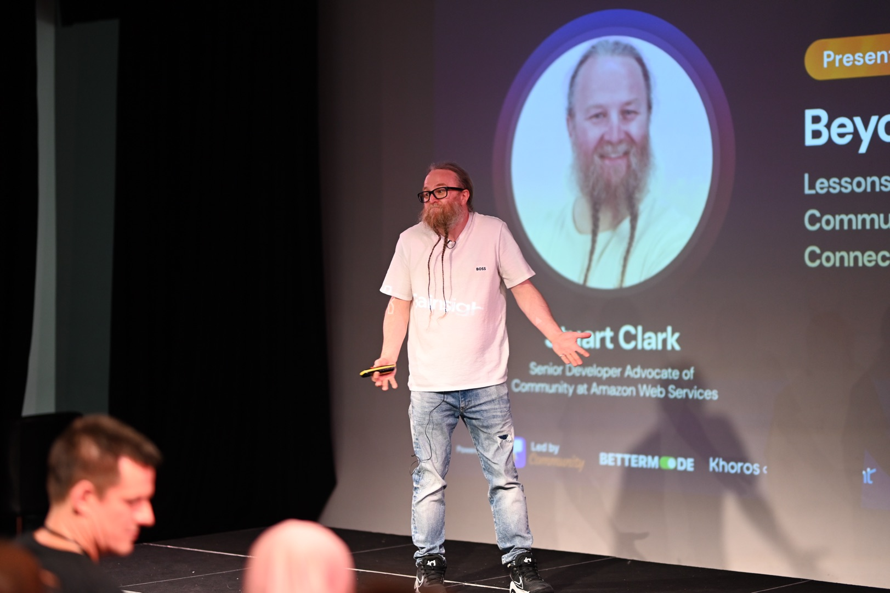

### Stuart is a Senior Developer Advocate, public speaker, author and DevNet Expert #2022005

Stuart is a sought-after speaker, frequently gracing the stages of industry conferences worldwide presenting on his expertise in programmability and DevOps methodologies. Passionate about fostering knowledge sharing, he actively creates community content and leads developer communities, empowering others to thrive in the ever-evolving tech landscape. In his previous role as a network engineer, he became obsessed with network automation and became a developer advocate for network automation. He contributed to the Cisco DevNet exams and was part of one of the SME teams which created, designed, and built the Cisco Certified DevNet Expert. He lives in Lincoln, England, with his wife, Natalie, and their son, Maddox. He plays guitar and rocks an impressive two-foot beard while drinking coffee. You can find him on social media @bigevilbeard.

