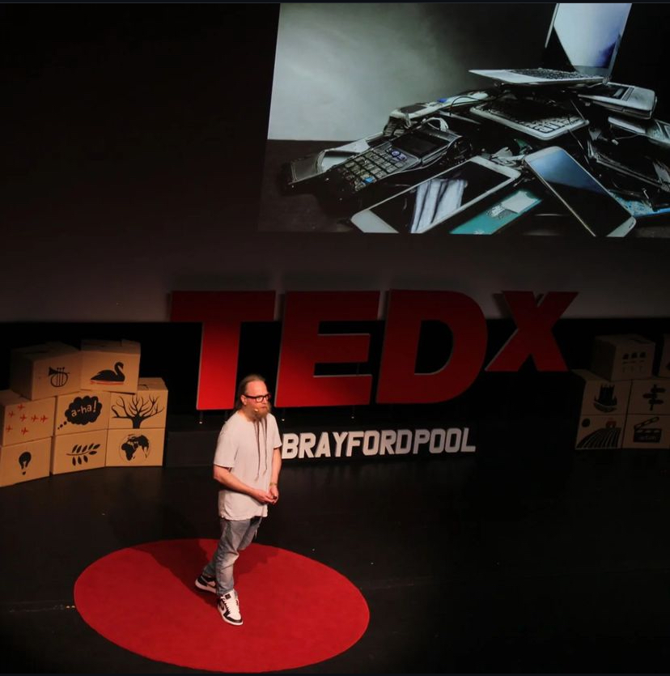

### Stuart is a Senior Developer Advocate | DevOps Pioneer | TEDx Speaker | International Keynote Speaker | Technical Author | CCIE #70062 / DevNet Expert #2022005

As a Senior Developer Advocate at Spotify, Stuart is interested in how the software we build — and the AI we use — affects our planet. He has shared his perspective on stages ranging from TEDx to DevOps conferences worldwide, aiming to provide fellow developers with the practical knowledge needed to build a more sustainable future.He lives in Lincoln, England, with his wife, Natalie, and their son, Maddox. He plays guitar and rocks an impressive two-foot beard while drinking coffee. You can find him on social media @bigevilbeard

